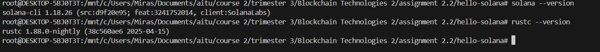
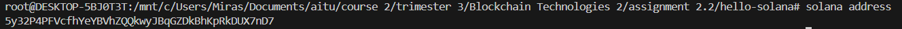
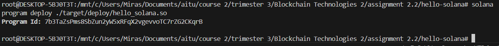

# Hello Solana – Smart Contract on Devnet 🚀

This project is a basic example of deploying and interacting with a Rust-based Solana smart contract on **Devnet**, created for **Assignment 2 – Blockchain Technologies 2** at AITU.

---

## 📦 Project Structure

```
hello-solana/
├── src/
│   └── lib.rs          # Rust smart contract logic
├── Cargo.toml
├── README.md
├── LICENSE
└── target/deploy/      # Compiled .so file for deployment
```

---

## ⚙️ Usage

### 1. Install Solana CLI
Follow the official guide:  
👉 https://solana.com/docs/cli/install-solana-cli-tools

### 2. Set Devnet as your default cluster
```bash
solana config set --url https://api.devnet.solana.com
```

### 3. Generate wallet and airdrop some SOL
```bash
solana-keygen new
solana airdrop 2
```

### 4. Build the program
```bash
cargo build-bpf
```

### 5. Deploy the program
```bash
solana program deploy ./target/deploy/hello_solana.so
```

### 6. Run the client example

After deploying the program, you can test it using the provided Rust client:

```bash
cargo run --example client
```

---

## 📸 Demo Screenshots

> 📷 Screenshots of:
- Solana CLI version
- Wallet address
- Successful program deployment

### ✅ Solana CLI Version


### ✅ Wallet Address


### ✅ Program Deployed



---

## 💡 Example Output

Upon calling the program, this message will appear in transaction logs:
```
Program log: Hello, Solana!
```

---

## 👨‍💻 Authors

- **Nurkassym Bolat** (abdaber)  
- **Miras Tulebyaev** (aftosmiros)

---

## 📝 License

This project is licensed under the [MIT License](./LICENSE).
